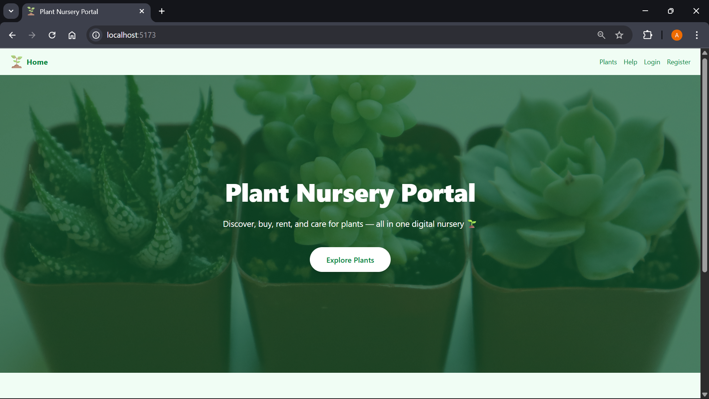
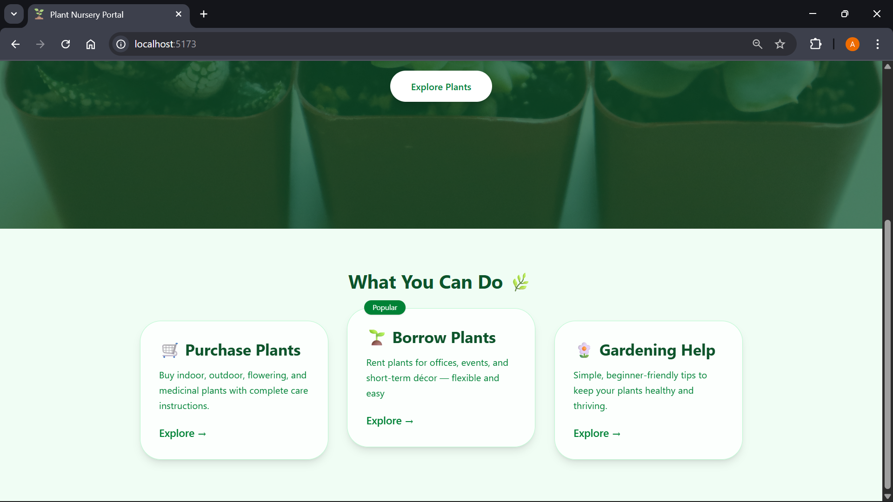
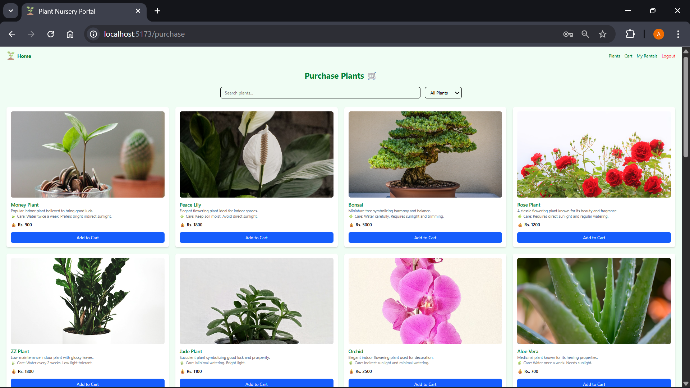
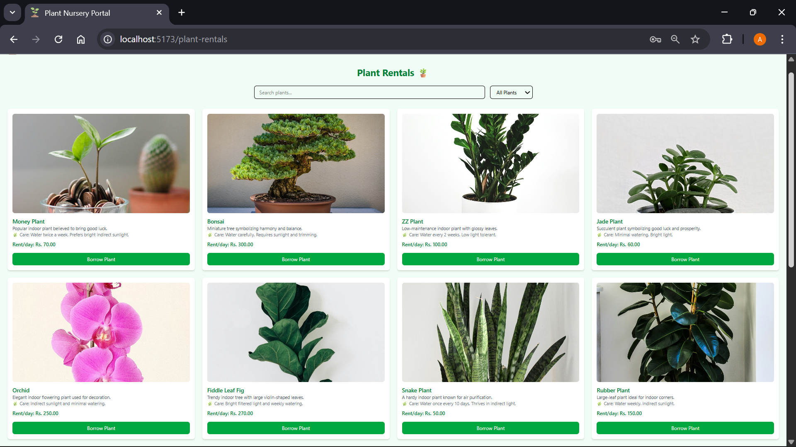
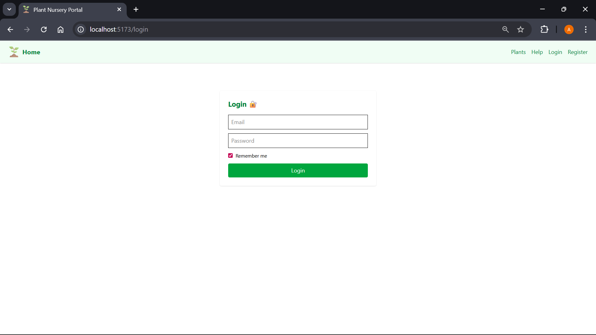
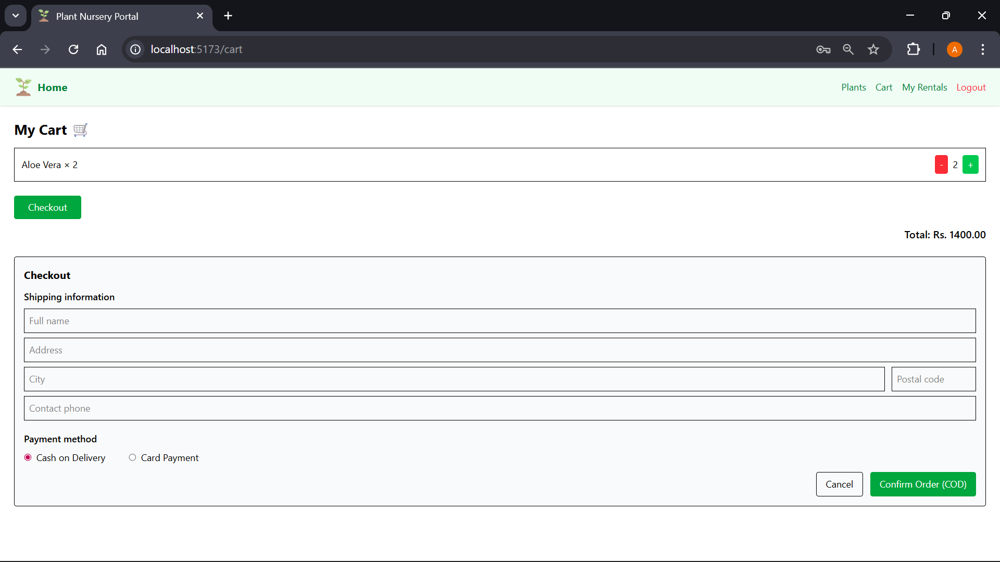
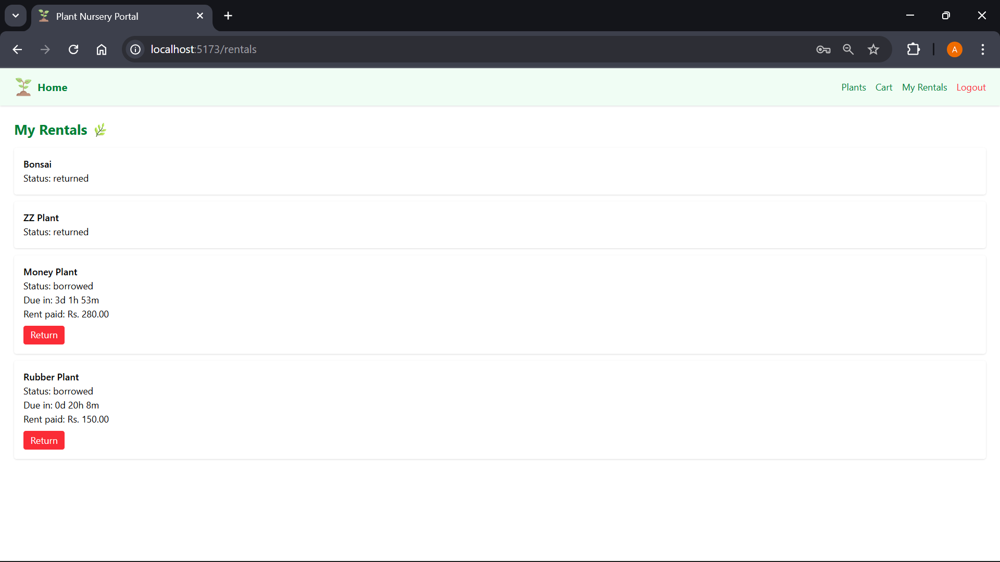
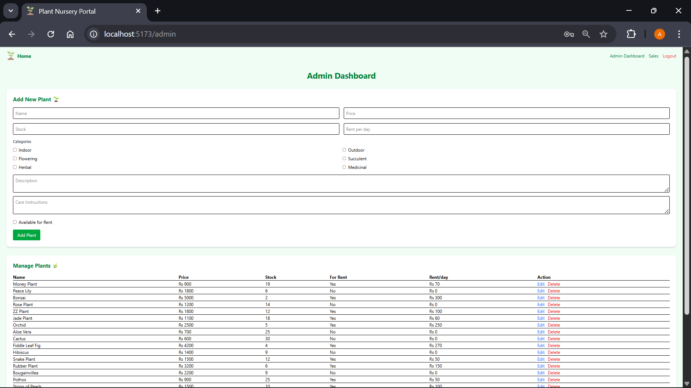
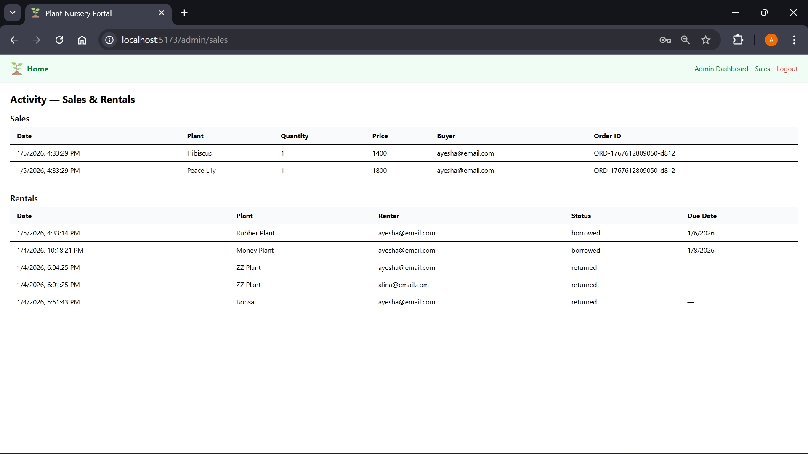

# 🌱 Plant Nursery Portal 

*A full-stack MERN web application for buying, renting, and managing plants with secure authentication, smart inventory control, and a modern responsive UI.* 

---

## Project Overview

The **Plant Nursery Portal** is a full-stack web application built using the **MERN stack (MongoDB, Express.js, React.js, Node.js)**. It provides a seamless digital experience for buying, renting, and managing plants, while also offering essential plant care guidance.

This system bridges the gap between traditional plant nurseries and modern e-commerce platforms by delivering a secure, responsive, and scalable solution for both customers and administrators.

---

## Tech Stack

### Frontend
- React.js  
- Tailwind CSS  
- Axios  

### Backend
- Node.js  
- Express.js  
- JWT Authentication  

### Database
- MongoDB (Local)

---

## Key Features

### 🔐 User Authentication & Authorization
- Secure registration & login  
- JWT-based authentication  
- Role-based access control (Admin & Customer)  

### 🌿 Digital Plant Catalog
- Name, price, stock, description, care instructions, categories  
- Real plant images  

### 🔍 Search & Filter
- Search by name  
- Filter by categories  

### 🛒 Shopping Cart
- Add items  
- Update quantities  
- Persistent user-specific cart  

### 💳 Checkout & Order Processing
- Simple checkout workflow  
- Backend stock validation  
- Multiple payment options  

### 🌱 Plant Rental System
- Temporary plant rentals  
- Tracks borrowed & returned plants  
- Prevents overbooking  
- User-based rental history  

### 🛠️ Admin Panel
- Add / update / delete plants  
- Manage stock  
- Monitor sales and rentals  

### 📱 Responsive UI
- Optimized for all screen sizes  

### 🔒 Secure APIs
- Protected endpoints  
- Authentication middleware  
- Error handling & validation  

---

## Screenshots

> Here's how the portal looks.

### Home Page




### Plants Catalog




### Login


### Shopping Cart


### Rental System


### Admin Dashboard




---

#  Setup & Usage Instructions (Local Environment)

> Follow these steps to run the project locally.

---

## Prerequisites

Make sure you have the following installed:

- Node.js (v16+ recommended)  
- MongoDB (Local installation or MongoDB Compass)  
- Git  

---

## 1️⃣ Clone the Repository

```
git clone https://github.com/ayesha-xainab/plant-nursery-portal.git
cd plant-nursery-portal
```

## 2️⃣ Backend Setup

```
cd backend
npm install
```
Create .env file inside /backend

``` env
PORT=5000
MONGO_URI=mongodb://127.0.0.1:27017/plant_nursery
JWT_SECRET=your_secret_key
```

Make sure MongoDB service is running locally before starting the backend.

```
Run Backend Server
npm run dev
```

Backend will run on:

http://localhost:5000

## 3️⃣ Frontend Setup

```
cd ../frontend
npm install
npm run dev
```

Frontend will run on:

http://localhost:5173

##  Admin Access Setup

To create an admin user, manually insert a user with role "admin" in MongoDB.

---

## Project Structure

plant-nursery-portal/
│
├── backend/
│   ├── controllers/
│   ├── models/
│   ├── routes/
│   ├── middleware/
│   └── server.js
│
├── frontend/
│   └── index.html
│   ├── src/
│       ├── components/
|       ├── context/
|       ├── pages/
│       ├── services/
│       └── main.jsx
│       └── App.jsx
│       └── index.css
|_______________________

---

## Development

This project welcomes any improvements and enhancements.
